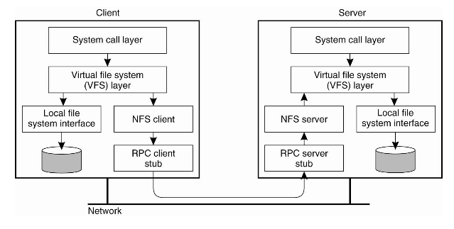

Linux 系统中，存储设主要有下面几种：

### DAS

DAS 指 **Direct Attached Storage**，即直连附加存储，这种设备直接连接到计算机主板总线上，计算机将其识别为一个块设备，例如常见的硬盘，U 盘等，这种设备很难做到共享。

### NAS

NAS 指 **Network Area Storage**，它一般是将本地的存储空间共享给其他主机使用，一般通过 C/S 架构实现通信。它实现的是**文件级别的共享**，计算机通常将共享的设别识别为一个文件系统，其文件服务器会管理锁以实现并发访问。常见的 NAS 有 NFS 和 CIFS。

### SAN
SAN 指 **Storage Area Network**，它将传输网络模拟成 SCSI 总线来使用，每一个主机的网卡相当于 SCSI 总线中的 initiator，服务器相当于一个或多个 target，它需要借助客户端和服务端的 SCSI 驱动，通过 FC 或 TCP/IP 协议封装 SCSI 报文。它实现的是**块级别的共享**，通常被识别为一个块设备，但是需要借助专门的锁管理软件才能实现多主机并发访问。

## FTP

FTP 是一个文件传输的协议，客户端需要使用专门的 ftp 客户端与服务器端进行通信，以完成文件的上传和下载，FTP 协议工作在应用层。它使用两个连接与客户端通信：

- 命令连接：用于传输文件管理类命令，此连接在客户端连接后会始终在线
- 数据连接：用于传输文件数据，此连接会按序创建

FTP 服务器会监听 TCP 21 号端口用于命令连接，而数据连接有两种模式：

- 主动模式，服务器使用 TCP 20 号端口主动创建连接到客户端的某随机端口
- 被动模式，客户端使用随机端口连接服务器端的随机端口

Linux 中常用的 FTP 客户端软件有 lftp, ftp, lftpget, wget, curl 等。Windows 中可以使用浏览器，资源管理器或 Filezilla 等软件。

FTP 协议中使用了类似于 HTTP 协议的响应码：

- 1xx：提示信息
- 2xx：成功类状态码
- 3xx：提示需进一步提供补充类信息的状态码
- 4xx：客户端错误
- 5xx：服务端错误

下面介绍 vsftpd 这款服务端软件的使用，FTP 在用户认证时，会使用系统中的用户进行身份认证，同时 FTP 支持虚拟用户，虚拟用户最终也需要映射为系统中的某个用户，匿名用户会被映射为系统中的 ftp 用户。

### 配置文件

vsftpd 使用了 pam 模块进行用户身份认证，配置文件为 `/etc/pam.d/vsftpd vsftpd` 的主配置文件为 `/etc/vsftpd/vsftpd.conf`

用户访问 FTP 时，默认访问的位置是用户自己的家目录。ftp 用户的家目录为 `/var/ftp/` ，因此使用匿名用户将默认访问 `/var/ftp` 目录。

#### 匿名用户的配置

`vsftpd.conf` 中，关于匿名用户的配置有

```
anonymous_enable=YES                # 是否允许匿名用户
anon_upload_enable=YES              # 匿名用户是否可以上传
anon_mkdir_write_enable=YES         # 匿名用户是否可以创建文件夹
anon_ohter_write_enable=YES         # 匿名用户的其他权限，如删除文件夹的权限
```

#### 本地用户的配置

```
local_enable=YES                    # 是否启用系统用户
write_enable=YES                    # 是否允许系统上传文件
local_umask=022                     # 上传的文件的默认 umask 值
```

当系统用户登录 FTP 后，默认位于其家目录中，但是也可以访问系统的其他目录，这样通常是不安全的。可以将系统用户禁锢于其家目录中：

```
chroot_local_user=YES               # 是否禁锢系统用户与其家目录中
```

也可以指定用户将其禁锢于家目录中：

```
chroot_list_enable=YES                      # 启用 chroot list 文件
chroot_list_file=/etc/vsftpd/chroot_list    # chroot list 文件
```

如果 `chroot_local_user` 为 NO，那么 `chroot list` 文件中的用户将被禁锢至家目录中，如果 `chroot_local_user` 为 YES，那么表示仅 `chroot_list` 文件中的用户不会被禁锢至家目录中。

#### 日志
```
xferlog_enable=YES                  # 是否启用传输日志
xferlog_file=/var/log/vsftpd.log    # 日志文件位置
```

#### 改变上传文件的属主

```
chown_uploads=YES                   # 是否修改用户上传文件的属主
chown_username=someone              # 修改的属主名称
```

#### 连接限制
```
max_clients=                        # 服务器的最大并发连接数
max_per_ip=                         # 每个 ip 可同时发起的并发请求数
anno_max_rate=                      # 匿名用户的最大传输速率，单位是 BYTE/s
local_max_rate=                     # 本地用户的最大传输速率
```
#### 用户登录控制
```
userlist_enable=YES                 # 启用userlist文件
userlist_deny=YES                   # YES 表示 userlist 为用户黑名单，NO 表示 userlist 为白名单
userlist_file /etc/vsftpd/user_list # userlist 文件位置
```

#### 虚拟用户

FTP 中，所有的虚拟用户会被统一映射为一个指定的系统帐号，访问的默认目录即为此帐号的家目录。虚拟用户账号也以存储在文件中，也可以存放在关系型数据库中。

**将 FTP 虚拟用户存放在数据库中**

准备数据库及相关表

```
mysql> create database vsftpd;
mysql> grant select on vsftpd.* to vsftpd@localhost identified by 'redhat';
mysql> grant select on vsftpd.* to vsftpd@127.0.0.1 identified by 'redhat';
mysql> flush privileges;
mysql> use vsftpd;
mysql> create table users (
    -> id int AUTO_INCREMENT NOT NULL,
    -> name char(20) binary NOT NULL,
    -> password char(48) binary NOT NULL,
    -> primary key(id)
    -> );
```

添加虚拟用户

这里使用 MySQL 的 password() 函数将用户密码加密，如果 pam_mysql 的password() 函数与 MySQL 的 password() 函数不同，也可以将密码明文存放。

```
mysql> insert into users(name,password) values('foo',PASSWORD('redhat'));
mysql> insert into users(name,password) values('bar',PASSWORD('redhat'));
```

安装 `pam_mysql` 包，建立 pam 认证所需文件，编辑 `/etc/pam.d/vsftpd.mysql`

```
auth required /lib64/security/pam_mysql.so user=vsftpd passwd=www.magedu.com host=localhost db=vsftpd table=users usercolumn=name passwdcolumn=password crypt=2
account required /lib64/security/pam_mysql.so user=vsftpd passwd=www.magedu.com host=localhost db=vsftpd table=users usercolumn=name passwdcolumn=password crypt=2
```

修改 vsftpd 配置文件，使其使用 mysql 认证

```
pam_service_name=vsftpd.mysql
anonymous_enable=YES
write_enable=YES
anon_upload_enable=NO
anon_mkdir_write_enable=NO
chroot_local_user=YES
guest_enable=YES
guest_username=vuser
```

建立虚拟用户映射的系统用户

```
# useradd -s /sbin/nologin -d /var/ftproot vuser
# chmod go+rx /var/ftproot
```

启用 vsftpd 服务 

```
# service vsftpd start
```

现在，就可以使用数据库中的 foo 和 bar 用户登录 FTP 了。

## NFS

NFS 全称是 Network FileSystem，NFS 和其他文件系统一样，是在 Linux 内核中实现的，因此 NFS 很难做到与 Windows 兼容。NFS 共享出的文件系统会被客户端识别为一个文件系统，客户端可以直接挂载并使用。

NFS 的实现使用了 RPC（Remote Procedure Call） 的机制，远程过程调用使得客户端可以调用服务端的函数。由于有 VFS 的存在，客户端可以像使用其他普通文件系统一样使用 NFS 文件系统，由操作系统内核将 NFS 文件系统的调用请求通过 TCP/IP 发送至服务端的 NFS 服务，执行相关的操作，之后服务端再讲操作结果返回客户端。



NFS 文件系统仅支持基于 IP 的用户访问控制，NFS 是在内核实现的，因此 NFS 服务由内核监听在 TCP 和 UDP 的 2049 端口，对于 NFS 服务的支持需要在内核编译时选择。它同时还使用了几个用户空间进程用于访问控制，用户映射等服务，这些程序由 nfs-utils 程序包提供。

RPC 服务在 CentOS 6.5 之后改名为 portmapper，它监听在 TCP/UDP 的 111 端口，其他基于 RPC 的服务进程需要监听时，先像 RPC 服务注册，RPC 服务为其分配一个随机端口供其使用。客户端在请求时，先向 RPC 服务请求对应服务监听的端口，然后再向改服务发出调用请求。

查看 RPC 服务列表：

```
[root@node2 ~]# rpcinfo -p
program vers proto   port  service
00    4   tcp    111  portmapper
00    3   tcp    111  portmapper
00    2   tcp    111  portmapper
00    4   udp    111  portmapper
00    3   udp    111  portmapper
00    2   udp    111  portmapper
24    1   udp  54525  status
24    1   tcp  36141  status
```

启用 NFS 服务，只需要编辑 `/etc/exports` 文件，文件格式如下

```
directory (or file system)   client1(option1, option2) client2(option1, option2)
```

例如，共享 /shared/nfs 目录给 10.0.0.0/8 网段的客户端，且具有读写权限：

```
/shared/nfs     10.0.0.0/8(rw)
```

之后启动 nfs 服务即可

```
# service nfs start
```

在括号中的共享选项中，下面的选项可以实现对 NFS 进行定制：

```
secure：   这个选项是缺省选项，它使用了 1024 以下的 TCP/IP 端口实现 NFS 的连接。指定 insecure 可以禁用这个选项。
rw：       这个选项允许 NFS 客户机进行读/写访问。缺省选项是只读的。
async：    这个选项可以改进性能，但是如果没有完全关闭 NFS 守护进程就重新启动了 NFS 服务器，这也可能会造成数据丢失。
no_wdelay：    这个选项关闭写延时。如果设置了 async，那么 NFS 就会忽略这个选项。
nohide：   如果将一个目录挂载到另外一个目录之上，那么原来的目录通常就被隐藏起来或看起来像空的一样。要禁用这种行为，需启用 hide 选项。
no_subtree_check： 这个选项关闭子树检查，子树检查会执行一些不想忽略的安全性检查。缺省选项是启用子树检查。
no_auth_nlm：  这个选项也可以作为 insecure_locks 指定，它告诉 NFS 守护进程不要对加锁请求进行认证。如果关心安全性问题，就要避免使用这个选项。缺省选项是 auth_nlm 或 secure_locks。
mp (mountpoint=path)： 通过显式地声明这个选项，NFS 要求挂载所导出的目录。
fsid=num： 这个选项通常都在 NFS 故障恢复的情况中使用。如果希望实现 NFS 的故障恢复，请参考 NFS 文档。
```
	
在使用 NFS 挂载的文件系统上的文件时，用户的访问通常都会受到限制，这就是说用户都是以匿名用户的身份来对文件进行访问的，这些用户缺省情况下对这些文件只有只读权限。如果用户希望以 root 用户或锁定义的其他用户身份访问远程文件系统上的文件，NFS 允许指定访问远程文件的用户——通过用户标识号（UID）和组标识号（GID）进行用户映射。

用户映射的选项：

```
root_squash： 这个选项不允许 root 用户访问挂载上来的 NFS 卷。
no_root_squash： 这个选项允许 root 用户访问挂载上来的 NFS 卷。
all_squash： 这个选项对于公共访问的 NFS 卷来说非常有用，它会限制所有的 UID 和 GID，只使用匿名用户。缺省设置是 no_all_squash。
anonuid 和 anongid： 这两个选项将匿名 UID 和 GID 修改成特定用户和组帐号。
```

客户端挂载 NFS 文件系统的方式

```
# mount -t nfs 10.10.0.2:/shared/nfs /mnt
```

还可以使用 showmount 命令查看主机上共享的 NFS 文件系统列表

```
# showmount -e IP_ADDR
```

其中 IP_ADDR 为 NFS 服务器地址。

如果服务器端修改了 NFS 的配置，而又不想重启 NFS 服务（因为有客户端正在使用）可以使用 exportfs 命令重新载入 NFS 配置。

```
export -ar: 重新导出所有的文件系统
export -au: 关闭导出的所有文件系统
export -u FS: 关闭指定的导出的文件系统
```

## Samba

NFS 只能在 Unix 系统间进行共享，而 Windows 对其支持很有限。因此有人就在 Linux/Unix 系统中实现了 Windows 文件共享所使用的 CIFS 协议，也叫做 SMB（Simple Message Block）协议。这使得 Windows/Linux/Unix 间可以自由的进行文件共享。

samba 主要监听在这几个端口：137/udp, 138/udp, 139/tcp, 445/tcp

在 Windows 中共享的文件系统，可以在 Linux 中使用 samba 客户端访问，或者直接挂载访问。

查看某主机共享的文件系统：

```
# smbclient -L HOST -U USERNAME
```

获取到信息后，使用 smbclient 进行访问

```
# smbclient //SERVER/shared_name -U USERNAME
```

基于挂载的方式访问：

```
# mount -t cifs //SERVER/shared_name /mount_point -o username=USERNAME, password=PASSWORD
```

在 Linux 中构建 samba 服务器，需要安装 samba 软件包，它共有两个服务，其中 smb 提供数据访问， nmb 提供 NetBIOS 的实现。

samba 的主板配置文件为： `/etc/samba/smb.conf`

samba 服务中的用户都必须是系统中存在的用户，使用时需要将这些用户加入到 samba 中来，使用 smbpasswd 命令：

```
smbpasswd:
    -a Sys_User: 添加系统用户为samba用户
    -d ：禁用
    -e: 启用
    -x: 删除
```

### 配置文件

`smb.conf` 中包含了许多全局设定，Windows 域设定等内容。

全局配置

```
workgroup = MYGROUP                         # 工作组名称
server string = Samba Server Version %v     # 描述信息，%v表示版本
netbios name = MYSERVER                     # NetBIOS中的名称
interfaces = lo eth0 192.168.12.2/24        # 监听的接口和地址
hosts allow = 127. 192.168.12. 192.168.13   # 访问控制白名单
```

日志选项

```
log file = /var/log/samba/log.%m        # 日志文件，%m表示客户端主机名称或ip
max log size = 50                       # 日志文件最大大小，单位
```

常用共享选项

```
[shared_name]
    path =                              # 文件系统路径
    browseable = {yes|no}               # 是否可以被查看到
    public = {yes|no}                   # 是否可被所有人读
    guest ok = {yes|no}                 # 与 public 相同
    read only = yes                     # 是否只读
    writeable = yes                     # 是否可写
    write list = user1, user2           # 可写用户列表
                @group, +group          # 可写组列表
    valid users =                       # 白名单
    invalid users =                     # 黑名单
```

配置完成后可以使用 testparm 命令查看语法使用有错误。

