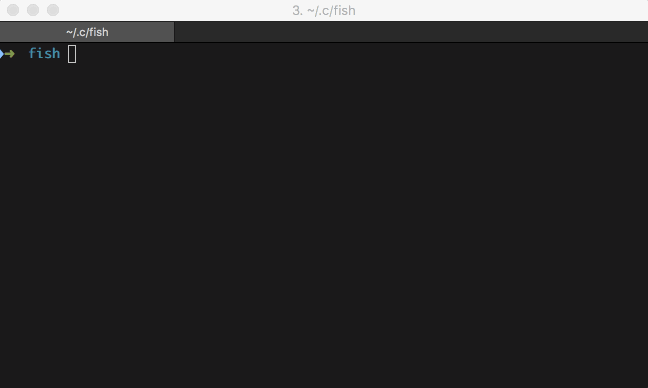
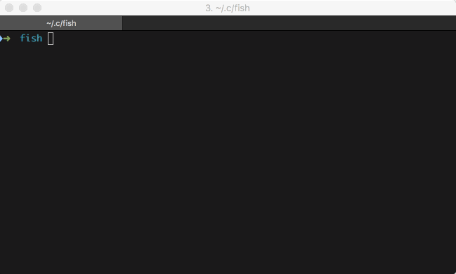
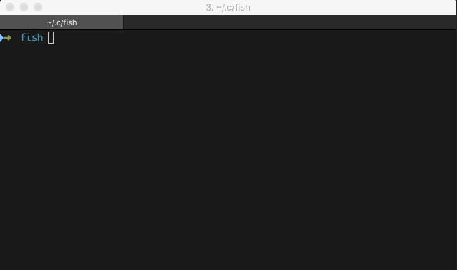
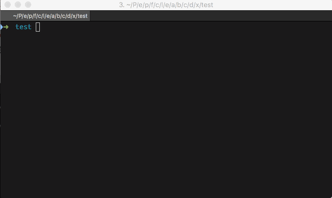

池建强老师曾经写过一篇[终极 shell](http://macshuo.com/?p=676)，为生活在水生火热中的 UNIX/Linux 用户普及了 zsh 的使用，池老师称之为「终极shell」。我想说的是，zsh 的确好用，但是逼格还不够，目前使用过最炫酷的 shell 非 fish shell 莫属，史称「究极shell」，实乃居家旅行装X吹牛的必备良器。

fish 的特性有：

- 开箱即用，不需要繁琐的配置
- 自动补全提示，杀手锏功能
- 上下键自动搜索相关历史命令
- 命令行脚本自动缩进
- 命令语法错误提示
- 改进了 bash 的语法（因此它不兼容 bash）

#### 安装

和「oh-my-zsh」 类似，fish 也有 [「oh-my-fish」](https://github.com/fish-shell/fish-shell) 项目来快速配置 fish shell。

首先，安装 fish，在 MacOS 中：

```bash
brew install fish
```

配置 oh-my-fish：

```bash
curl -L http://get.oh-my.fish | fish
```

这样就完成了 fish 的配置，相关的配置文件在 `~/.config/fish` 目录下。

如果需要查看文档，在 fish 中键入：

```
help
```

即可，fish 会打开一个 web 页面显示 fish 的文档，十分友好。

#### 更换主题

可以使用 `omf theme` 命令来配置主题，可供使用的主题可以在[这里查看](https://github.com/oh-my-fish/oh-my-fish/blob/master/docs/Themes.md)。

#### 插件

fish 是一个即开即用的 shell，因此你即使不做任何配置，现在就可以体验它的强大功能了。

**自动补全提示**

自动补全提示功能，fish 最最强大的功能，也是 fish 原生自带的。虽然 zsh 也有类似插件，但是使用感受差距太大，这也是让我从 zsh 切换到 fish 的主要原因。


一旦你输入任何字符，fish 会从历史记录中搜索相同起始字符的历史命令记录，并以灰色的方式在 shell 中进行提示。如果你想复用这条命令，使用 `ctrl-f` 就可以直接快速补全整条命令，如果想复用这条命令的前半段，可以使用 `alt-f` 和 `alt-b` 控制光标以单词为单位前进或后退 。

**错误检测**

当你输入的命令有误（拼写错误）时，fish 能够自动以红色提示你命令不存在：



命令提示符中拼写错误或不存在的命令会以红色标识，正确的命令会以绿色标识 。

**历史记录查找**

假设你的命令历史记录里有这么一条命令：`find . -name '*.py'`，要查找这条命令，首先输入 `find`，fish 会自动提示以 `find` 起始的最近一条命令，如果这条命令不是你想要的，那么你可以使用 `↑` 或者 `ctrl-p` 来向上搜索，搜索时会以当前命令行中的字符作为关键词，这样你就能向上查找所有包含 `find` 字符的历史命令了。



这里紫色背景的字符就是搜索的关键字。

**补全**

fish 的补全功能与 zsh 类似，能够支持路径补全，命令参数补全：



补全选择时使用 `ctrl-f` 和 `ctrl-b` 进行左右移动，`tab` 和 `shift-tab` 进行上下移动。

**autojump**

神器 autojump 这里就不多介绍了，autojump 是支持 fish shell 的，安装后就可以使用 `j` 来跳转目录了。

**bd**

bd 也是一个目录跳转工具，假如你处在这样一个目录中：

`~/Project/example/project/foo/codes/lib/extras/`

现在你想回到 `~/Project/example/project/` 父目录，你会怎么办？

你可以输入 `cd ../../../../` 或者 `cd ~/Project/example/project/`，但似乎都不是很便捷的方法，使用 `bd` 可以方便在父目录间进行跳转：



bd 也有对应的 fish 版本，安装之前，首先安装 `fisherman`：

```bash
curl -Lo ~/.config/fish/functions/fisher.fish --create-dirs git.io/fisher
```

然后使用 fisher 安装 bd 即可：

```bash
fisher install 0rax/fish-bd
```

**fzf**

fish 没有 bash 中 `ctrl-r` 历史命令搜索的功能，可以安装 fzf 来实现更强大的搜索功能。

MacOS 中可以使用 Homebrew 来安装 fzf。

```bash
brew install fzf

# Install shell extensions
/usr/local/opt/fzf/install
```

**functions**

fish 还提供了很多的快捷函数（fish 中没有 alias 的概念），可以在[这里查看](https://github.com/fish-shell/fish-shell/tree/master/share/functions)

#### fish语法

关于 fish 的语法这里不多介绍了，可以在在命令行输入 `help` 查看文档。由于作者对 bash 奇葩语法的厌恶，fish 是不兼容 bash/zsh 语法的，将来也不会做兼容的打算。因此很多时候我们需要对不支持 fish 的软件中的脚本进行修改才可以在 fish 中运行，不过 fish 本来就是给 geek 们使用的。

> just hack it.


