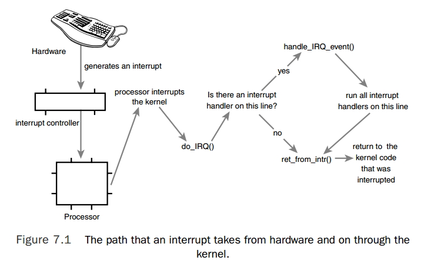

众所周知，处理器的速度跟外围硬件设备的速度往往不在一个数量级上，因此，如果内核采取让处理器向硬件发出一个请求，然后专门等待回应的办法，显然差强人意。

轮询（polling）可能会是一种解决办法。它可以让内核定期对设备的状态进行查询，然后做出相应的处理。不过这种方法很可能会让内核做不少无用功，因为轮询总会周期性的重复执行。更好的办法是提供一种机制，让硬件在需要的时候再向内核发出信号。这就是中断机制。

## 中断

中断使得硬件得以发出通知给处理器。例如，敲击键盘，键盘控制器会发送一个中断，通知操作系统有键按下。中断本质上是一种特殊的**电信号**，由硬件设备发向处理器。处理器接收到中断后，会马上向操作系统反映此信号的到来，然后就由操作系统负责处理这些新到来的数据。硬件设备生成中断的时候并不考虑与处理器的时钟同步 —— 即**中断随时可以产生**。因此，内核随时可能因为新到来的中断而被打断。

从物理学的角度看，中断是一种电信号，由硬件设备生成，并直接送入中断控制器的输入引脚中 —— 中断控制器是个简单的电子芯片，其作用是将多路中断管线，复用为一个和处理器相连接的管线与处理器通信。当接收到一个中断后，中断控制器会给处理器发送一个电信号。处理器已经检测此信号，便中断自己当前工作转而处理中断。此后，处理器会通知操作系统已经产生中断，这样，操作系统就可以对这个中断进行适当的处理了。

不同设备对应的中断不同，每个中断都通过一个唯一的数字标志，因此操作系统能够对中断进行区分，并知道哪个硬件设备产生了哪个中断。

这些值被称为中断请求（IRQ）线。每个 IRQ 线都会被关联一个数值，例如 IRQ0 是时钟中断，IRQ1 是键盘中断。在 PCI 总线上的设备而言，中断是动态分配的。

## 异常

异常与中断不同，它在产生时必须考虑与处理器时钟同步。实际上，异常也常常称为同步中断。在处理器执行到由于编程失误而导致的错误指令（如被 0 除）的时候，或者是在执行期间出现特殊情况（如缺页，page fault），必须靠内核来处理的时候，处理器就会产生一个异常。因为许多处理器体系结构处理异常与处理中断的方式类似，因此内核对它们的处理也很类似。

处理中断与处理异常的方式类似，差异在于中断是由硬件而不是软件引起的。

### 中断处理程序

在响应一个特定中断的时候，内核会执行一个函数，该函数叫做中断处理程序（interrupt handler）或中断服务例程（interrupt service routine, ISR）。不同的中断对应相应的中断处理程序。一个设备的中断处理程序是它设备驱动程序的一部分，设备驱动程序是用于对设备进行管理的内核代码。

在 Linux 中，中断处理程序就是普普通通的 C 函数。只不过这些函数必须按照特定的类型声明。中断处理程序与其他内核函数的真正区别在于，中断处理程序是被内核调用来响应中断的，而它们运行于中断上下文中。中断上下文偶尔也称为原子上下文，因为该上下文中的执行代码**不可阻塞**。

中断可能随时发生，因此中断处理程序也就随时可能执行。例如，网络设备的中断处理程序将来自硬件的网络数据报拷贝到内存，对其进行处理后再交给合适的协议栈或应用程序。

### 上半部与下半部

中断程序既要运行的快，又要完成大量的工作，这两个目的显然有所矛盾。因此一般把中断处理切为两个部分。中断处理程序是上半部（top half）—— 接收到一个中断，它就立即开始执行，但只做有严格时限的工作，例如对接收的中断进行应答或复位硬件，这些工作都是在所有中断被禁止的情况下完成的。能够允许稍后完成的工作会推迟到下半部（bottom half）去。此后，在合适的时机，下半部会被执行。

以网卡为例，网卡接收到来自网络的数据包时，立即发出中断通知内核，内核通过执行网卡已注册的中断处理程序来做出应答，中断开始执行，通知硬件，拷贝最新的网络数据包到内存，然后读取网卡更多的数据包。这些都是重要、紧迫而又与硬件相关的工作。内核通常需要快速的拷贝网络数据包到系统内存，因为网卡上接收网络数据包的缓存大小固定，如果延迟，会造成缓存溢出。当网络数据包被拷贝到系统内存后，中断的任务完成，这时它将控制权还给系统被中断前原先运行的程序。处理和操作数据包的其他工作在随后的下半部中进行。


### 注册中断处理程序

中断处理程序是管理硬件的驱动程序的组成部分，每一设备都有相关的驱动程序，如果设备使用中断，那么相应的驱动程序就注册一个中断处理程序。

驱动程序通过 `request_irq()` 函数注册一个中断处理程序，并激活给定的中断线。一些中断号是预先确定的，如系统时钟或键盘，对于大多数其他设备，这个值要么可以通过探测获取，要么可以通过编程动态确定。

### 重入和中断处理程序

Linux 的中断处理程序是无须重入的。当一个给定的中断处理程序正在执行时，相应的中断线在所有处理器上都会被屏蔽掉，以防止在同一中断线上接收另一个新的中断。通常情况下，所有其他的中断都是打开的，所以这些不同中断线上的其他中断都能被处理，但当前中断线是被禁止的。因此，同一个中断处理程序绝对不会被同时调用以处理嵌套的中断。


### 中断上下文

当执行一个中断程序时，内核处于中断上下文（interrupt context）中。进程上下文是一种内核所处的操作模式，此时内核代表进程执行，例如执行系统调用或运行内核线程。在进程上下文，可以通过 current 宏关联当前进程。因为进程是以进程上下文连接到内核中的，进程上下文可以睡眠，也可以调用调度程序。

中断上下文和进程没有什么瓜葛。因为没有后备进程，所以中断上下文不可以睡眠。因此不能从中断上下文调用某些函数。如果一个函数睡眠，就不能在中断处理程序中使用它。

因为中断上下文打断了其他代码（甚至可能是打断其他中断线上的），中断上下文中的代码应该迅速、简洁，尽量不要使用循环去处理繁重的工作。

中断处理程序并不具有自己的栈，它们共享所中断进程的内核栈，因此没有进程可调度时，空任务运行。


### 中断处理机制的实现

中断处理机制在 Linux 中的实现是非常依赖于体系结构的，它的实现依赖于处理器，所使用的中断处理器的类型、体系结构的设计及机器本身。



上图是中断从硬件到内核的路由。设备产生中断，通过总线把电信号发送给中断控制器。如果中断线是激活的（它们是允许被屏蔽的），那么控制器就把中断发往处理器。在大多数体系结构中，这个工作就是通过电信号给处理器的特定管脚发送一个信号。除非在处理器上禁止该中断，否则处理器会立即停止它正在做的事，关闭中断系统，然后跳到内存中预定义的位置开始执行那里的代码。这个预定义的位置是由内核设置的，是中断处理程序的入口点。


### /proc/interrupts

procfs 是一个虚拟文件系统，它只存在于内核内存，一般挂载于 /proc 目录。在 procfs 中读写文件都要调用内核函数，这些函数模拟从真实文件中读或写。/proc/interrupts 文件存放的是系统中与中断相关的统计信息。

```bash
[root@bogon kernel]# cat /proc/interrupts 
            CPU0       CPU1       
   0:       1167          0   IO-APIC-edge      timer
   1:        135          0   IO-APIC-edge      i8042
   8:          1          0   IO-APIC-edge      rtc0
   9:          0          0   IO-APIC-fasteoi   acpi
  12:        205          0   IO-APIC-edge      i8042
  14:          0          0   IO-APIC-edge      ata_piix
  15:        108          0   IO-APIC-edge      ata_piix
  16:          0          0   IO-APIC-fasteoi   ehci_hcd:usb1
  17:     231993     184627   IO-APIC-fasteoi   ioc0
  18:    1492950     628600   IO-APIC-fasteoi   uhci_hcd:usb2, eth1
  19:     547436         41   IO-APIC-fasteoi   eth0
 NMI:          0          0   Non-maskable interrupts
 LOC:    9735415    7303736   Local timer interrupts
 SPU:          0          0   Spurious interrupts
 PMI:          0          0   Performance monitoring interrupts
 IWI:          0          0   IRQ work interrupts
 RES:     212365     225566   Rescheduling interrupts
 CAL:     114054     129796   Function call interrupts
 TLB:     260312     332043   TLB shootdowns
 TRM:          0          0   Thermal event interrupts
 THR:          0          0   Threshold APIC interrupts
 MCE:          0          0   Machine check exceptions
 MCP:       1030       1030   Machine check polls
 ERR:          0
 MIS:          0
```

第 1 列是中断线，第 2 列是一个接收中断数目的计数器，系统中每个处理器都存在这样的列。第 4 列是处理这个中断的中断控制器。在具有 I/O APIC 的系统上，大多数中断会列出 IO-APIC-level 或 IO-APIC-dege，作为自己的中断控制器。最后一列是与这个中断相关的设备名字，这个名字是通过参数 devname 提供给函数 `request_irq()` 的。如果中断是共享的，则这条中断线上注册的所有设备都会列出来。


### 中断控制
Linux 内核提供了一组接口用于操作机器上的中断状态。这些接口提供了能够禁止当前处理器的终端系统，或屏蔽掉整个机器的一条中断线的能力。

一般来说，控制中断系统的原因是需要提供同步。通过禁止中断，可以确保某个中断处理程序不会抢占当前的代码。此外，禁止中断还可以禁止内核抢占。然后不管是禁止中断还是禁止内核抢占，都没有提供任何保护机制来防止来自其他处理器的并发访问。Linux 支持多处理器，因此，内核代码一般都需要获取某种锁，防止来自其他处理器对共享数据的并发访问。获取这些锁的同时也伴随着禁止本地中断。锁提供保护机制，防止来自其他处理器的并发访问，而禁止中断提供保护机制，则是防止来自其他中断处理程序的并发访问。


## 小结

中断是一种由设备使用的硬件资源异步向处理器发信号。实际上，中断就是由硬件来打断操作系统。

大多数现代硬件都通过中断与操作系统通信。对给定硬件进行管理的驱动程序注册中断处理程序，是为了响应并处理来自相关硬件的中断。中断过程中所做的工作包括应答并重新设置硬件，从设备拷贝数据到内存以及反之，处理硬件请求，并发送新的硬件请求。

内核提供的接口包括注册和注销中断处理程序、禁止中断、屏蔽中断线以及检查中断系统的状态。

因为中断打断了其他代码的执行（进程、内核本身、甚至其他中断处理程序），它们必须赶快执行完，但是通常是还有很多工作要做。内核把处理中断的工作分为两半。

**同步中断和异步中断**

1. 同步中断是当指令执行时由 CPU 控制单元产生，之所以称为同步，是因为只有在一条指令执行完毕后 CPU 才会发出中断，而不是发生在代码指令执行期间，比如系统调用。同步可以是程序错误或者异常（如page fault）。
2. 异步中断是指由其他硬件设备依照 CPU 时钟信号随机产生，即意味着中断能够在指令之间发生，例如键盘中断。

Intel 微处理器手册称同步中断为「异常(Exception)」, 称异步中断为「中断(Interrupt)」，而平时所说的中断，两者都包含。


