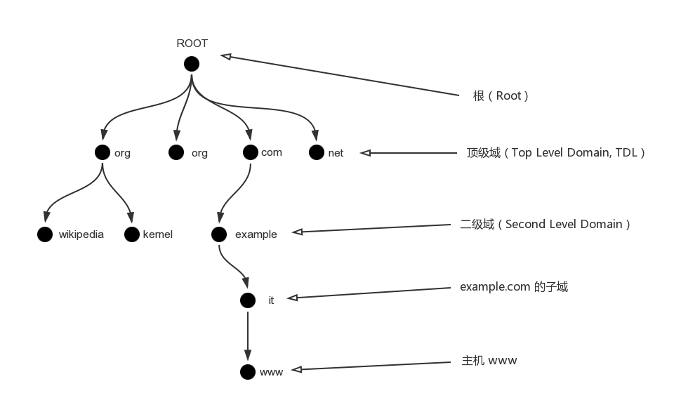
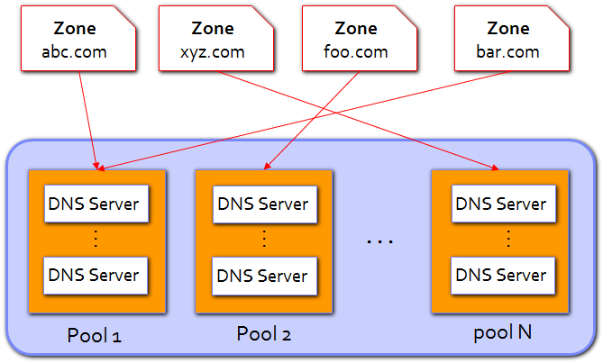

## puppet-designate
1. [DNS基础知识](#DNS)

2. [快速了解designate](#基础知识)

3. [先睹为快—一言不合，立马动手？](#先睹为快)

4. [核心代码－如何管理designate服务](#核心代码讲解)

5. [designate原理](#designate原理)

6. [designate使用场景](#使用场景)

7. [小结](#小结)

8. [动手练习](#动手练习)


**本节作者：薛飞扬**

**阅读级别：选读**

**建议阅读时间 2小时**

## DNS
想要搞懂Designate项目，没有正确的DNS姿势怎么行？所以先别急，我们先来聊一聊dns的那些事。
### DNS简介
DNS 的全称是 Domain Name System，DNS 负责主机名字之间和互联网络地址之间的映射，在我们上网或者发送电子邮件的时候，一般都会使用主机名而不是 IP 地址，因为前者更容易记忆，但是对于计算机，使用数字（IP 地址）则更为方便。DNS 能够帮助我们将主机名转换成计算机更容易识别的 IP 地址。从而完成主机之前的通信。

### DNS层级结构
DNS是一个层级的分布式的数据库，以 C/S 架构工作，它将互联网名称（域名）和 IP 地址的对应关系记录下来，可以为客户端提供名称解析的功能。它允许对整个数据库的各个部分进行本地控制，借助备份和缓存机制， DNS 将具有足够的强壮性。

DNS 数据库以层级的树状结构组织，最顶级的服务器被称为「根」（root），以 . 表示，它是所有子树的根。root 将自己划分为多个子域（subdomain），这些子域包括 com，net，org，gov，net 等等，这些子域被称为顶级域（Top Level Domain, TDL）。再进一步，各顶级域再将自己划分成多个子域，子域还可以在划分子域，最后树的叶子节点就是某个域的主机名。整个结构如下图所示：

每个域的名称服务器仅负责本域内的主机的名称解析，如果需要解析子域的主机，就需要再向其子域的名称服务器查询。这样一来，无论主机在哪个域内，都可以从根开始一级一级的找到负责解析此主机名称的域，然后完成域名解析。

###BIND DNS 服务器
BIND 是由 Berkely 大学研发的一款开源 DNS 服务器程序，同时也是最为流行的。在 CentOS 系统中，由 bind 软件包提供安装。
Bind的两个配置文件：

* /etc/named.conf：主要规范主机的设定、zone file 的所在、权限的设定等；  
主要配置如下：

```
options {
        listen-on port 53 { 127.0.0.1; };    
        directory "/var/named";  //资料库预设放置的目录所在
        dump-file "/var/named/data/cache_dump .db"; //一些统计资讯
        statistics-file "/var/named/data/named_stats.txt";
        memstatistics-file "/var/named/data/named_mem_stats.txt";
        allow-query { any; };      //可不设定，代表全部接受
        recursion no;                    //将自己视为用户端的一种查询模式
};

```

* 正反解资料库档案(zone file)：/var/named/目录下，一个zone file由多条资源记录组成。  

```
$TTL 1D
@       IN SOA  LinuxMaster.test.com.  admin.test.com. (
                                        2016092605      ; serial
                                        21600           ; refresh
                                        3600            ; retry
                                        604800          ; expire
                                        86400 )         ; minimum
        IN NS   LinuxMaster
```
###DNS服务器类型
| 服务器类型 | 作用 |
| --- | --- |
| 缓存服务器 | 不负责解析，仅为加速，不需要注册 |
| 主DNS服务器 | 负责解析本地客户端请求 |
| 辅助DNS服务器 | 辅助服务器的区域数据都是从主服务器复制而来，其数据都是只读的 |

缓存服务器需要配置：

 ```
 options {
        forward only;                    
        forwarders {                     
                168.95.1.1;               //先用中华电信的DNS当上层
                139.175.10.20;            //再用seednet当上层
        };
};
 ```
 
 Master DNS服务器需要配置：
 
 ```
 zone "test.com" IN {
        type master;
        file "test.com.zone";
};
 ```
 Slave DNS服务器需要配置：
 
 ```
 zone "test.com" IN {
        type slave;
        masters {ip;};
        file "slaves/test.com.zone";
};
 ```
 Slave必须要与Master相互搭配，当要修改一条记录时，只要手动更改Master那部机器的zone file，重新启动BIND这个服务后（或者等待一定时间），slave会自动同步这条更改的记录。
基本上，不论Master 还是Slave 的资料库，都会有一个代表该资料库新旧的『序号』，这个序号数值的大小，会影响是否要更新的动作。至于更新的方式主要有两种：

* Master主动告知：例如在Master在修改了资料库内容，并且加大资料库序号后，重新启动DNS服务，那master会主动告知slave来更新资料库，此时就能够达成资料同步；
* 由Slave主动提出要求：基本上， Slave会定时的向Master察看资料库的序号，当发现Master资料库的序号比Slave自己的序号还要大(代表比较新)，那么Slave就会开始更新。如果序号不变，那么就判断资料库没有更动，因此不会进行同步更新。

###DNS资源记录类型
资源记录：
标准的资源记录具有其基本格式：[name]　　　[ttl]　　　IN　　type　　rdata

| 类型 | 含义 |
| --- | --- |
| IN | 此字段用于将当前记录标识为一个INTERNET的DNS资源记录 |
| type | 类型字段，用于标识当前资源记录的类型 |
| rdata | 用于描述资源的信息且长度可变的必要字段，随CLASS和TYPE的变化而变化 |

每个区域数据库文件都是由资源记录构成的。type的值主要有：SOA记录、NS记录、A记录、CNAME记录、MX记录和PTR记录。

| 资源记录类型 | 描述 | 一句话描述 |
| --- | --- | --- |
| 起始授权结构（SOA） | 用于一个区域的开始，SOA记录后的所有信息均是用于控制这个区域的，每个区域数据库文件都必须包含一个SOA记录，并且必须是其中的第一个资源记录，用以标识DNS服务器管理的起始位置，SOA说明能解析这个区域的dns服务器中哪个是主服务器。 | 指出当前区域内谁是主DNS服务器 |
| 主机（A） | 即是A记录，也称为主机记录，是DNS名称到IP地址的映射，用于正向解析。 | 将域名FQND映射到IP  正向解析 |
| 别名（CNAME） | CNAME记录，也是别名记录，用于定义A记录的别名。 | 将A记录指向的域名指向另外一个域名 |
| 邮件交换器（MX） | 邮件交换器记录，用于告知邮件服务器进程将邮件发送到指定的另一台邮件服务器。（该服务器知道如何将邮件传送到最终目的地）。 | 指出当前区域内 SMTP邮件服务器IP |
| 名称服务器（NS） | NS记录，用于标识区域的DNS服务器，即是说负责此DNS区域的权威名称服务器，用哪一台DNS服务器来解析该区域。一个区域有可能有多条ns记录，例如zz.com有可能有一个主服务器和多个辅助服务器。 | 指出当前区域内有几个DNS服务器在提供服务 |
| 反向解析(PRT) | 是IP地址到DNS名称的映射，用于反向解析。 | 将IP解析为域名FQND  | 

### DNS客户端
dig 是 Linux 下常用的 DNS 查询工具，在 CentOS 系统中，由 bind-utils 软件包提供，它的使用方法为：

dig -t RRT NAME [@NAME_SERVER]

其中，RRT 表示资源记录类型，NAME 表示查询的地址，@NAME_SERVER 可以指定 DNS 服务器，如果不指定则使用操作系统默认的 DNS 服务器。

例如，查询 www.kernel.org 的 IP 地址：

```
[root@bogon ~]# dig -t A www.kernel.org @172.16.0.1

; <<>> DiG 9.8.2rc1-RedHat-9.8.2-0.30.rc1.el6 <<>> -t A www.kernel.org @172.16.0.1
;; global options: +cmd
;; Got answer:
;; ->>HEADER<<- opcode: QUERY, status: NOERROR, id: 35532
;; flags: qr rd ra; QUERY: 1, ANSWER: 4, AUTHORITY: 3, ADDITIONAL: 4

;; QUESTION SECTION:
;www.kernel.org.			IN	A

;; ANSWER SECTION:
www.kernel.org.		600	IN	CNAME	pub.all.kernel.org.
pub.all.kernel.org.	600	IN	A	199.204.44.194
pub.all.kernel.org.	600	IN	A	198.145.20.140
pub.all.kernel.org.	600	IN	A	149.20.4.69
...(省略)
```


## 基础知识

### Designate介绍

OpenStack Designate提供了DNSaaS（DNS即服务）的功能，其目标就是要赋予OpenStack提供这种云域名系统的能力，云服务商可以使用Designate就能够很容易建造一个云域名管理系统来托管租户的公有域名。

Designate的架构图如下：


| 包含的服务 | 简介 |
| --- | --- |
| designate-api | 接收来自远端用户的HTTP/HTTPS请求，通过Keystone验证远端用户的合法性，将HTTP/HTTPS请求传递给Central模块。 |
| designate-central | 业务逻辑处理核心。响应API请求以及处理Sink所监听到的来自Nova和Neutron的特定通知事件。同时会存取数据库，对业务逻辑处理所产生的数据进行持久化存储。 |
| designate-mdns | 实现了标准的DNS Notify和Zone Transfer的处理。 |
| designate-pool-manager | 连接后端驱动，管理DNS服务器池，与MiniDNS配合同步DNS服务器的域名以及资源记录等数据。 |
| designate-sink | 监听来自Nova和Neutron的某些事件，用于自动生成域名资源记录，比如当监听到Nova的compute.instance.create.end事件通知后，自动创建一条对应于刚创建的实例的A记录；当监听到Nuetron的floatingip.update.end事件通知后，自动更新一条相应的A记录。 |
### DNS服务器的池划管理

Designate kilo版本所引入的pool manager机制将DNS服务器群划分成多个服务器池（pool），如下图所示，每个服务器池可以配置包含1台或多台DNS服务器。而且，池中的DNS服务器选型还可以不同，也就是说在一个服务器池中，可以有1台BIND服务器，还可以有1台PowerDNS服务器，这是完全支持的。



服务器池的引入目的：

1. 细化域名托管的颗粒度。用户请求托管的域名可以委派到某一个服务器池，而不需要在所有服务器上管理用户的域名和资源记录，降低了管理和运维的复杂度。例如，abc.com委派给pool 1的DNS服务器来管理，xyz.com委派到pool N的DNS服务器来管理，……
2. 每个服务器池可以包含多台DNS服务器，实现了高可用性和冗余备份。
3. 服务器池的划分不受地域的限制，可以将分布在不同地域的DNS服务器划归到同一个池中，通过GLB和anycast路由技术可以实现就近DNS查询和负载均衡，加快DNS查询速度。

官方文档上给了一个多个池的使用场景：

The idea is that we’ll configure our pools to support different usage levels. We’ll define a gold and standard level and put zones in each based on the tenant.

Our gold level will provide 6 nameservers that users have access to where our standard will only provide 2. Both pools will have one master target we write to.
即通过配置不同的池来支持不同的用户等级。

黄金等级的池提供6个nameservers ，而标准等级的池只提供两个。

在mitaka版本，实现了CLI的方法来更新池,即通过创建一个yaml文件来定义池,然后通过desigante-manage来更新池，在后面的designate原理部分，贴出了一个yaml，仅供参考。

## 先赌为快

在讲解designate模块之前让我们先使用puppet把我们的实验环境部署起来,请根据你的具体环境修改learn_designate.pp


```

 include '::rabbitmq'

 include '::mysql::server'

＃创建database和user
 class {'::designate::db::mysql':

   password => $designate_db_password,

 }
＃创建designate group 和user,安装openstack-designate-common包,修改配置文件中rabbitmq的相关内容
 class {'::designate':

   rabbit_host     => $rabbit_host,

   rabbit_userid   => $rabbit_userid,

   rabbit_password => $rabbit_password,

 }

 include '::designate::dns'

 ＃配置designate的后端DNS服务器为bind9，安装bind9包，运行named服务，更改rndc的相关配置

 include '::designate::backend::bind9'

 class {'::designate::db':

   database_connection => "mysql://designate:${designate_db_password}@${db_host}/designate"

 }

 ＃populate designate database 

 include '::designate::db::sync'

＃下面四个class对应desigante的api,central,mdns,pool-manager四个服务

 class {'::designate::api':

   auth_strategy => $auth_strategy,

 }

 class {'::designate::central':

   backend_driver => $backend_driver,

 }

 include '::designate::mdns'

 class {'::designate::pool_manager': 

   pool_id => $pool_id, 

 }

```


在终端执行以下命令:

```
puppet apply -v learn_designate.pp
```

ok，接下来快创建一个domain试试吧。

```bash
designate domain-create --name example.com. --email root@example.com

designate domain-list
```

## 核心代码讲解

### backend

Designate backend支持如BIND，PowerDNS等多种类型的DNS服务器，下面只以BIND为例来讲解

Designate backend 如果使用应用最为广泛的bind，designate会利用RNDC指令来管理DNS伺服器，所以需要更改rndc的相关配置

```
class designate::backend::bind9 (

 $rndc_host = '127.0.0.1',

 $rndc_port = '953',

 $rndc_config_file = '/etc/rndc.conf',

 $rndc_key_file = '/etc/rndc.key'

) {

 include ::designate
＃安装bind相关的包，更改bind相关配置项
 include ::dns

＃配置rndc监听的host,port,config和key的目录
 designate_config {

 'backend:bind9/rndc_host' : value => $rndc_host;

 'backend:bind9/rndc_port' : value => $rndc_port;

 'backend:bind9/rndc_config_file' : value => $rndc_config_file;

 'backend:bind9/rndc_key_file' : value => $rndc_key_file;

 }


＃更改named.conf(或者named.options)文件，允许创建新的zone
 concat::fragment { 'dns allow-new-zones':

 target => $::dns::optionspath,

 content => 'allow-new-zones yes;',

 order => '20',

 }

}

```

puppet-designate的安装简单来说做了三件事：

* 后端DNS服务器的安装和配置，这一点上面已经有过讲解
* designate相关软件包的安装

```

package { 'designate-common':

 ensure => $package_ensure,

 name => $common_package_name,

 tag => ['openstack', 'designate-package'],

 }

designate::generic_service { 'api':

 enabled => $enabled,

 manage_service => $service_ensure,

 ensure_package => $package_ensure,

 package_name => $api_package_name,

 service_name => $::designate::params::api_service_name,

 }
...

```

* desingate配置文件的管理
  除了权限的相关配置，其它的配置项都在/etc/designate/designate.conf中
  [oslo_messaging_rabbit]下面是rabbitmq的相关参数，由class designate管理：

```

designate_config {

 'oslo_messaging_rabbit/rabbit_userid' : value => $rabbit_userid;

 'oslo_messaging_rabbit/rabbit_password' : value => $rabbit_password, secret => true;

 'oslo_messaging_rabbit/rabbit_virtual_host' : value => $rabbit_virtual_host_real;

 'oslo_messaging_rabbit/rabbit_use_ssl' : value => $rabbit_use_ssl;

 'oslo_messaging_rabbit/kombu_ssl_ca_certs' : value => $kombu_ssl_ca_certs;

 'oslo_messaging_rabbit/kombu_ssl_certfile' : value => $kombu_ssl_certfile;

 'oslo_messaging_rabbit/kombu_ssl_keyfile' : value => $kombu_ssl_keyfile;

 'oslo_messaging_rabbit/kombu_ssl_version' : value => $kombu_ssl_version;

 'oslo_messaging_rabbit/kombu_reconnect_delay' : value => $kombu_reconnect_delay;

 }
```

［service:api］  [service:central]  [serivce:mdns] [service:pool_manager] 中的配置项分别由class designate::api designate::central designate::mdns designate::manager管理

## designate原理
此处以具体的环境为例来介绍designate的原理
实验环境：

* 系统为centos7.2
* designate-api, designate-central, designate-pool-manager, designate-mdns, rabbitmq, mysql, keystone 均部署在10.0.2.250
* bind分别部署在10.0.2.250 10.0.2.249

下面贴出pools.yaml的配置：

```
- also_notifies:
  - host: 10.0.2.249
    port: 53
  attributes: {}
  description: Pool built from configuration on localhost
  id: 794ccc2c-d751-44fe-b57f-8894c9f5c842
  nameservers:
  - host: 10.0.2.250
    port: 53
  - host: 10.0.2.249
    port: 53
  ns_records:
  - hostname: server-250.2.stage.polex.io.
    priority: 1
  - hostname: server-249.2.stage.polex.io.
    priority: 2
  targets:
  - masters:
    - host: 10.0.2.250
      port: 5354
    options:
      rndc_config_file: /etc/rndc.conf
      rndc_host: 127.0.0.1
      rndc_key_file: /etc/rndc.key
      rndc_port: '953'
    type: bind9
  - masters:
    - host: 10.0.2.250
      port: 5354
    options:
      rndc_config_file: /etc/rndc.conf
      rndc_host: 10.0.2.249
      rndc_key_file: /etc/rndc.key
      rndc_port: '953'
    type: bind9
```
Designate工作流程：

* 用户请求designate-api,添加record或者domain  
* designate-api发送请求至mq中  
* designate-central接收到mq请求,写入db,同时通过mq触发pool_manager进行更新操作  
* pool_manager通过rndc(addzone/delzone/notifyzone)三个操作来通知pool_targets中定义的bind来进行操作  
* bind使用axfr来请求同步mdns  
* mdns从数据库中读取相应的domain信息来响应axfr请求

###Target vs. Nameserver
当通过designate 增加／修改／删除记录时，会通过target 去write changes。  
当dns客户端去查询记录时，则会通过nameserver.  
以本次实验环境为例，当通过designate创建一个名为example.com的domain时，安装上面的pool.yaml配置，相当于执行了这两条命令：

```
rndc -s 127.0.0.1 -p 953 -c /etc/rndc.conf -k /etc/rndc.key addzone example.com '{ type slave; masters { 10.0.2.250 port 5354; }; file "slave.example.com.75c9e003-a8f4-4771-a94e-4481ee019f1f"; };'
rndc -s 10.0.2.249 -p 953 -c /etc/rndc.conf -k /etc/rndc.key addzone example.com '{ type slave; masters { 10.0.2.250 port 5354; }; file "slave.example.com.75c9e003-a8f4-4771-a94e-4481ee019f1f"; };'
```
可以看到这些配置项都是在target中定义的。
一个要解析的域名就是一个zone,一个zone对应/var/named/目录下的一个zone_file.在250和249机器上，都能找到新创建的这个文件：

```
[root@server-250.2.stage.polex.io named ]$ ll
total 32
-rw-r--r--. 1 named named  544 Nov  3 17:50 3bf305731dd26307.nzf
drwxrwx---. 3 named named   70 Nov  3 17:35 data
drwxrwx---. 2 named named   58 Nov  4 16:32 dynamic
-rw-r-----. 1 root  named 2076 Jan 28  2013 named.ca
-rw-r-----. 1 root  named  152 Dec 15  2009 named.empty
-rw-r-----. 1 root  named  152 Jun 21  2007 named.localhost
-rw-r-----. 1 root  named  168 Dec 15  2009 named.loopback
drwxr-x---. 2 root  named    6 Oct 19 14:03 puppetstore
-rw-r--r--. 1 named named  409 Nov  4 19:12 slave.example.com.75c9e003-a8f4-4771-a94e-4481ee019f1f
drwxrwx---. 2 named named    6 Mar 16  2016 slaves
```

通过dig 查询创建的server1.example.com记录时，返回信息为：

```
[root@server-250.2.stage.polex.io ~ ]$ dig server1.example.com @10.0.2.250

; <<>> DiG 9.9.4-RedHat-9.9.4-29.el7_2.3 <<>> server1.example.com @10.0.2.250
;; global options: +cmd
;; Got answer:
;; ->>HEADER<<- opcode: QUERY, status: NOERROR, id: 31922
;; flags: qr aa rd ra; QUERY: 1, ANSWER: 1, AUTHORITY: 2, ADDITIONAL: 1

;; OPT PSEUDOSECTION:
; EDNS: version: 0, flags:; udp: 4096
;; QUESTION SECTION:
;server1.example.com.		IN	A

;; ANSWER SECTION:
server1.example.com.	3600	IN	A	1.2.3.4

;; AUTHORITY SECTION:
example.com.		3600	IN	NS	server-249.2.stage.polex.io.
example.com.		3600	IN	NS	server-250.2.stage.polex.io.

;; Query time: 0 msec
;; SERVER: 10.0.2.250#53(10.0.2.250)
;; WHEN: Fri Nov 04 18:45:55 CST 2016
;; MSG SIZE  rcvd: 130
```
### Hidden Master
前面有提到过，当我们创建一个名为example.com的domain时，执行的rndc命令都指定master host：10.0.2.250， port:5354
在designate.conf的定义中，我们可以看到：

```
[service:mdns]
threads = 1000
host = 0.0.0.0
port = 5354
tcp_backlog = 100
tcp_recv_timeout = 0.5
query_enforce_tsig = False
```
5354是service designate-mdns监听的端口。
所以说，250，249两台机器上的bind都是使用axfr来请求同步mdns，它们的记录都是同步过来的（所以某种意义上讲，它们都是slave节点）。
这样的好处就是，如果250，249有公网ip,它的53接口能被访问，那么它的记录是不能通过外网来更改的（外网只能查询），对于dns记录的更改只能通过内网（10.0.2.250）designate api的方式。

## 使用场景
###解析私有域名

```
＃创建一个domain
designate domain-create --name example03.com. --email root@example.com
＃创建一条记录
designate record-create --name server1.example03.com. --type A --data 1.2.3.4 ec5818c9-c9ca-4bd2-8ad4-4a964a39a24b
＃使用dig测试
[root@server-250.2.stage.polex.io named ]$ dig @10.0.2.250 server1.example03.com

; <<>> DiG 9.9.4-RedHat-9.9.4-29.el7_2.3 <<>> @10.0.2.250 server1.example03.com
; (1 server found)
;; global options: +cmd
;; Got answer:
;; ->>HEADER<<- opcode: QUERY, status: NOERROR, id: 51643
;; flags: qr aa rd ra; QUERY: 1, ANSWER: 1, AUTHORITY: 2, ADDITIONAL: 1

;; OPT PSEUDOSECTION:
; EDNS: version: 0, flags:; udp: 4096
;; QUESTION SECTION:
;server1.example03.com.		IN	A

;; ANSWER SECTION:
server1.example03.com.	3600	IN	A	1.2.3.4

;; AUTHORITY SECTION:
example03.com.		3600	IN	NS	server-250.2.stage.polex.io.
example03.com.		3600	IN	NS	server-249.2.stage.polex.io.

;; Query time: 0 msec
;; SERVER: 10.0.2.250#53(10.0.2.250)
;; WHEN: Fri Nov 04 19:20:58 CST 2016
;; MSG SIZE  rcvd: 132


```

###与nova和neutron集成
designate-sink 通过nova handler 和 neutron handler，自动生成域名资源记录，比如当监听到Nova的compute.instance.create.end事件通知后，自动创建一条对应于刚创建的实例的A记录；当监听到Nuetron的floatingip.update.end事件通知后，自动更新一条相应的A记录。
一个domain如下：

```
designate record-list 98775b46-c868-4dd8-94fd-6bd789a5dbaa
+--------------------------------------+------+-----------------+-------------------------------------------------------------------------+
| id                                   | type | name            | data                                                                           |
+--------------------------------------+------+-----------------+--------------------------------------------------------------------------------+
| e61e814f-5bd4-4de8-9c11-5c87fe1b2799 | SOA  | bluesky.edu.au. | hurricane109.in.vpac.org. hostmaster.v3.org.au. 1412735313 3600 600 86400 3600 |
+--------------------------------------+------+-----------------+--------------------------------------------------------------------------------+

```
当创建一个虚拟机后，自动创建一条A记录：

```
designate record-list 98775b46-c868-4dd8-94fd-6bd789a5dbaa
+--------------------------------------+------+------------------------+--------------------------------------------------------------------------------+
| id                                   | type | name                   | data                                                                           |
+--------------------------------------+------+------------------------+--------------------------------------------------------------------------------+
| 680eb3f5-016f-45a3-ac34-e79ff46bf8df | SOA  | bluesky.edu.au.        | hurricane109.in.vpac.org. hostmaster.v3.org.au. 1412739659 3600 600 86400 3600 |
| c66481bd-bd4f-4f90-976a-67b6654c4c60 | A    | phobos.bluesky.edu.au. | 10.0.0.7                                                                       |
+--------------------------------------+------+------------------------+--------------------------------------------------------------------------------+
```

## 小结

puppet-designate需要配置的文件仅有designate.conf，为了方便管理与配置，puppet把使用到的四个服务都分别写为了一个.pp的类，这样也方便我们管理这些配置项。这里讲解到功能没有涉及到跟nova，neutron的集成，集成之后的效果是当创建虚拟机或创建浮动IP后，创建的虚拟机或浮动ip的A记录记录会自动同步相应的zone 中 ，有兴趣的同学可以在官网查看。

## 动手练习

1.部署分布式的backend后端，并使用不同的DNS Server（BIND,PowerDNS,MysqlBIND）作存储后端。

2.手动配置多个pool,不同的pool管理的各自的DNS Server(通过创建yaml文件，使用designate-manage命令实现)。

3.安装designate-sink服务，修改nova.conf和neutron.conf相应配置，创建虚拟机或floating ip  ，观察designate record的变化。


